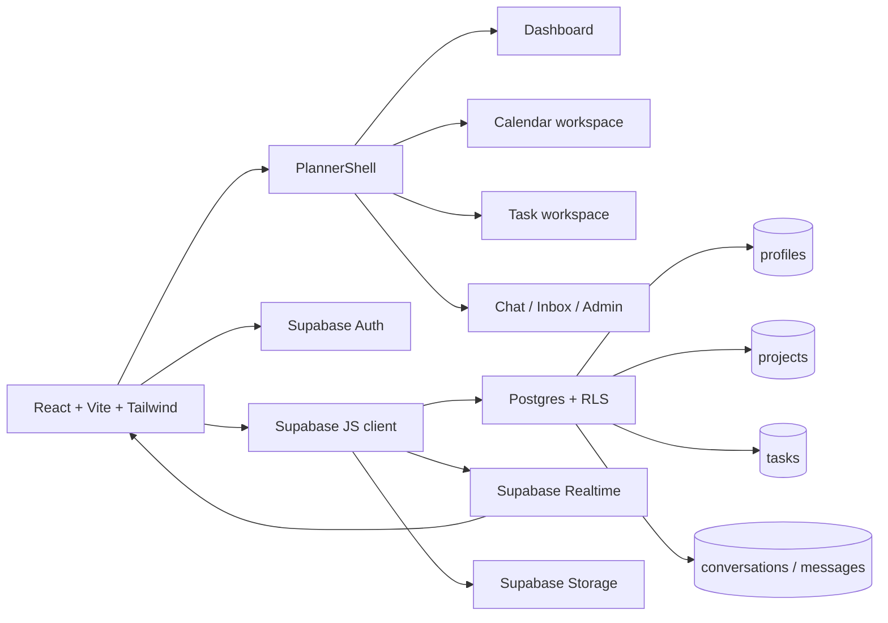
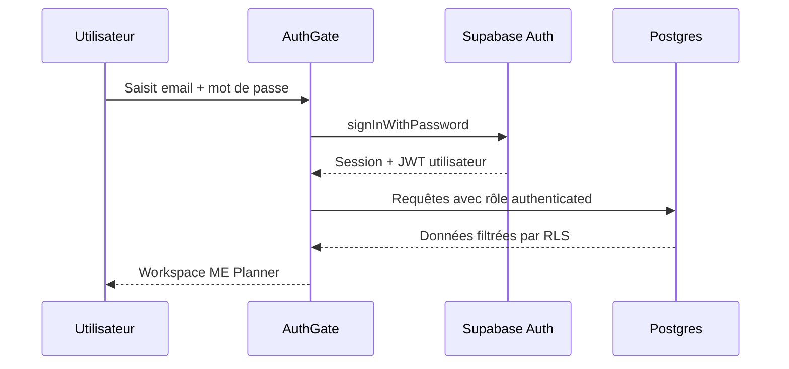

# Architecture ME Planner — Mon Essentiel

## Vue d’ensemble

## Flux d’authentification

## Principes de frontière

Le navigateur ne reçoit qu’une clé publishable et un JWT de session. Les policies RLS déterminent l’accès aux lignes. Une éventuelle clé `sb_secret` ne doit être utilisée que dans un environnement backend contrôlé, jamais dans `VITE_*`, le client React ou le dépôt GitHub.
